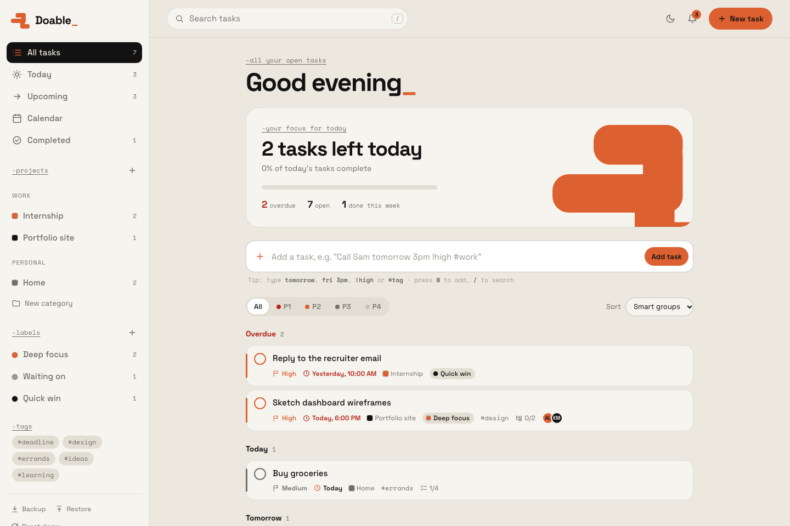
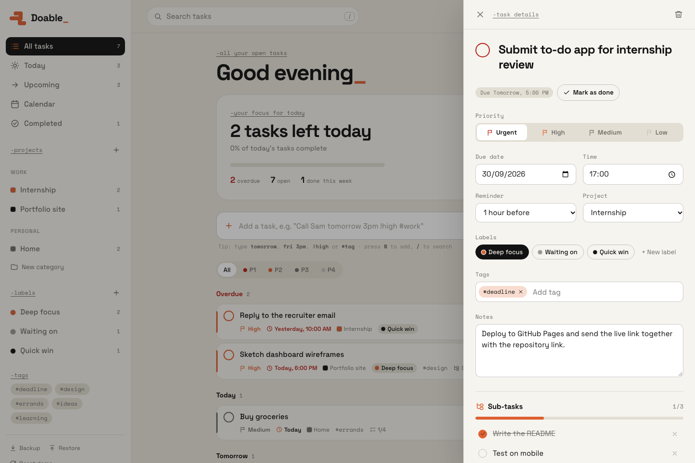
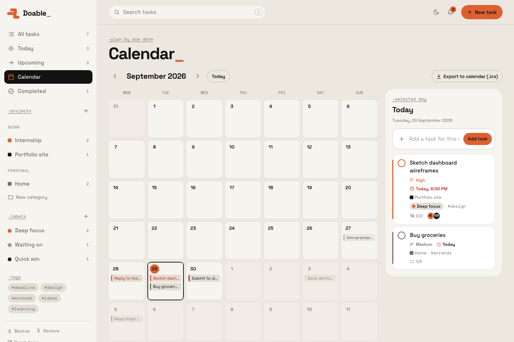
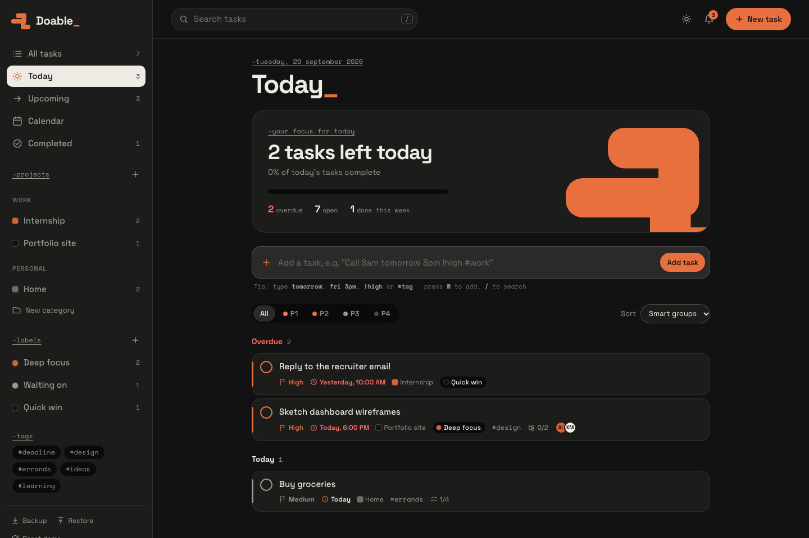
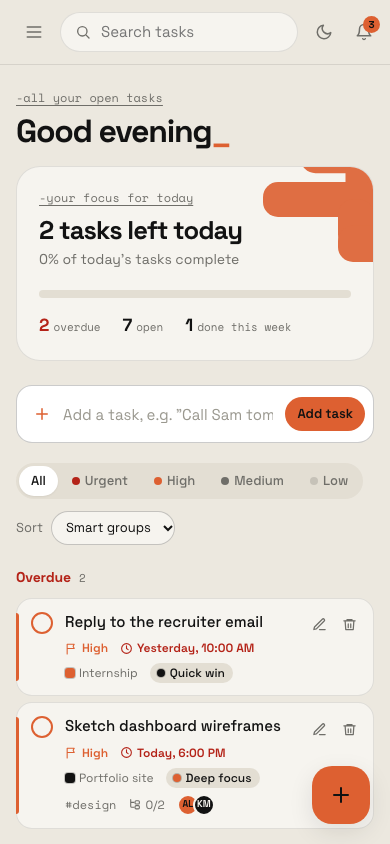

# Doable_ — a to-do list app

A fast, good-looking to-do list app with priorities, due dates, reminders, calendar sync, sub-tasks, checklists, projects, labels, tags and collaborators. It's built with plain **HTML, CSS and JavaScript**: no frameworks, no build step and no install.



## Run it

1. Download or clone this repository.
2. Double-click **`index.html`** to open it in your browser.

That's it. The app opens with demo data so you can explore right away. Use **Reset demo** in the sidebar to get it back at any time.

> **Live demo:** https://doable-gift.vercel.app/ (mirror on [GitHub Pages](https://giftobafaiye.github.io/To-do-list-App/))

## Features

| Requirement | How Doable_ handles it |
| --- | --- |
| **Create tasks** | Quick-add bar that understands plain English: `Call Sam tomorrow 3pm !high #work` sets the date, time, priority and tag for you, with a live preview. |
| **Edit tasks** | Click any task to open the details panel. Every field saves as you go. |
| **Delete tasks** | From the task row or the details panel, with **Undo**. |
| **Mark as done** | Tick the circle. Completed tasks move to *Completed* (also undoable). |
| **Due dates** | Date and optional time. Tasks are grouped into *Overdue, Today, Tomorrow, Next 7 days, Later*. |
| **Notifications** | A bell notification centre, pop-up toasts and optional desktop alerts for tasks that are **due soon** or **overdue**. Reminders can be set from *at due time* to *1 day before*. |
| **Calendar linkage** | A month calendar view, one-click **Google Calendar** and **Outlook** links, and **.ics export** (Apple Calendar and others) with the reminder built in, so your own calendar also alerts you. |
| **Prioritise tasks** | Four levels (Urgent / High / Medium / Low) with colour coding, a priority filter and sort-by-priority. |
| **Collaborators** | Invite people to a task by email with *Can edit* / *Can view* roles. Opens your email app with a ready-written invite. |
| **Notes** | A notes field on every task, included in search and calendar exports. |
| **Labels, tags & priorities** | Colour labels you manage in the sidebar, free-form `#tags`, and priorities, each with its own filtered view. |
| **Sub-tasks & checklists** | Sub-tasks (each with an optional due date) and a separate checklist, both with progress bars. |
| **Projects & categories** | Projects grouped under categories (e.g. *Work → Internship*). Deleting a project keeps its tasks rather than losing them. |

**Extras:** dark mode, a responsive mobile layout, search, five sort orders, keyboard shortcuts, backup/restore to a JSON file, and data saved automatically in the browser.

### Keyboard shortcuts

| Key | Action |
| --- | --- |
| `N` | New task |
| `/` | Search |
| `Esc` | Close panel / dialog |
| `Enter` | Save title, add sub-task, add tag |

## Screenshots

| Task details | Calendar |
| --- | --- |
|  |  |

| Dark mode | Mobile |
| --- | --- |
|  |  |

## How it's built

```
index.html            page shell, loads the styles and scripts
css/
  tokens.css          design tokens: colours, fonts, radii, light and dark themes
  base.css            reset, typography, buttons, form fields
  layout.css          sidebar, top bar, details drawer, responsive rules
  components.css      task rows, hero card, calendar, modals, toasts
js/
  icons.js            inline SVG icons
  utils.js            date helpers, HTML escaping, downloads
  seed.js             demo data (dates relative to today)
  store.js            all data and every way to change it, saved to localStorage
  parser.js           turns "tomorrow 3pm !high #work" into task fields
  calendar.js         Google / Outlook links and .ics file generation
  notifications.js    checks for due and overdue tasks every 30 seconds
  views.js            turns data into HTML
  app.js              handles clicks, typing and shortcuts
tests/                unit tests: open tests/index.html in a browser
```

**Data flow:** the user clicks → `app.js` calls a `Store` function → the store updates the data, saves it and notifies subscribers → `render()` rebuilds the page from `Views`. There is one source of truth, and data only changes in one place.

**Design decisions**

- **No framework, on purpose.** The brief is a to-do app, and plain JavaScript keeps it fast, readable and runnable anywhere by double-clicking. The store/views split mirrors how React or Vue apps are organised, so moving to a framework later would be straightforward.
- **Design system from a reference image.** Burnt orange as the primary colour, cream and graphite for balance, a grotesk typeface with typewriter-style labels, and the stepped rounded-block shape used in the logo and hero. Every value is a token in `css/tokens.css`.
- **Accessibility.** Semantic buttons and labels, visible focus rings, full keyboard support, `aria-pressed` / `aria-live` where they apply, black text on orange (it passes WCAG AA, which white on orange doesn't), and support for reduced motion.
- **Security.** All user text is HTML-escaped before rendering, which prevents XSS.
- **Undo instead of "Are you sure?"** for everyday actions, which is faster and more forgiving. Confirmations are kept for bulk or destructive actions.

## Tests

Open `tests/index.html` in a browser. It runs 21 unit tests covering the natural-language parser, date logic, overdue detection, HTML escaping and the calendar (.ics) export.

## Known limitations and next steps

This is a front-end-only app, so a few features are deliberately scoped:

- **Collaboration** sends a real email invite, but collaborators can't edit the same task live. That needs a backend. **Next step:** add Firebase or Supabase for accounts, shared tasks and real-time sync.
- **In-app reminders** fire while the app is open in a tab. For reminders when the browser is closed, export to your calendar (the .ics alarms handle it). **Next step:** push notifications through a service worker and a server.
- **Desktop alerts** need the browser's permission. Some browsers block them for files opened directly from disk, so they work best from the hosted version.
- Data is stored per browser. Use **Backup / Restore** to move it between devices.

## Deployment

The app is static files only, so any static host works. It's deployed in two places, and both redeploy automatically on every push to `main`:

- **Vercel** (https://doable-gift.vercel.app/): the GitHub repository is imported into Vercel with the Framework Preset set to *Other* and no build command.
- **GitHub Pages** (https://giftobafaiye.github.io/To-do-list-App/): served from the `main` branch, root folder.
